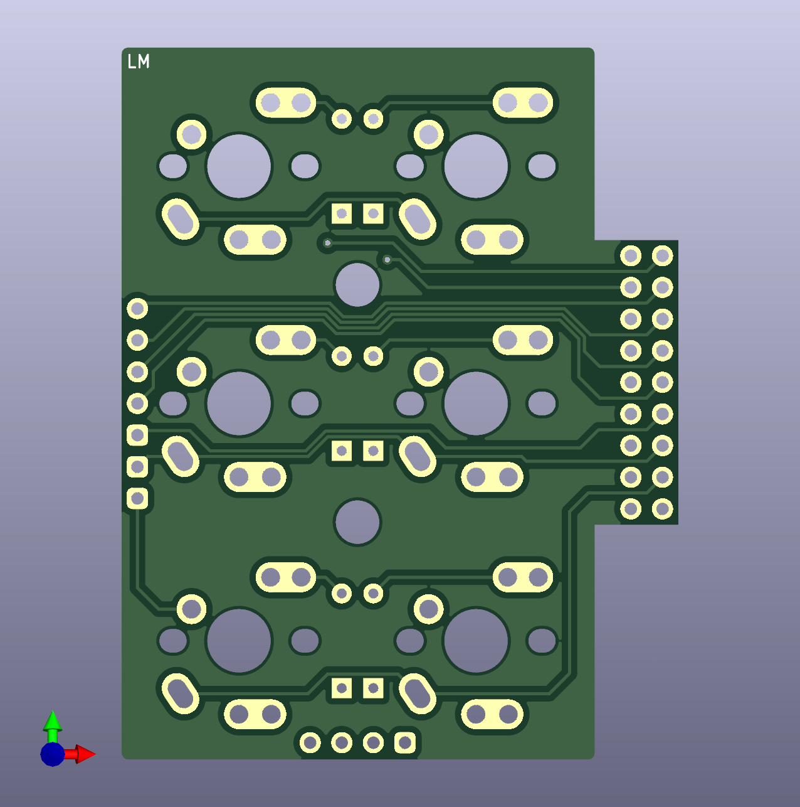
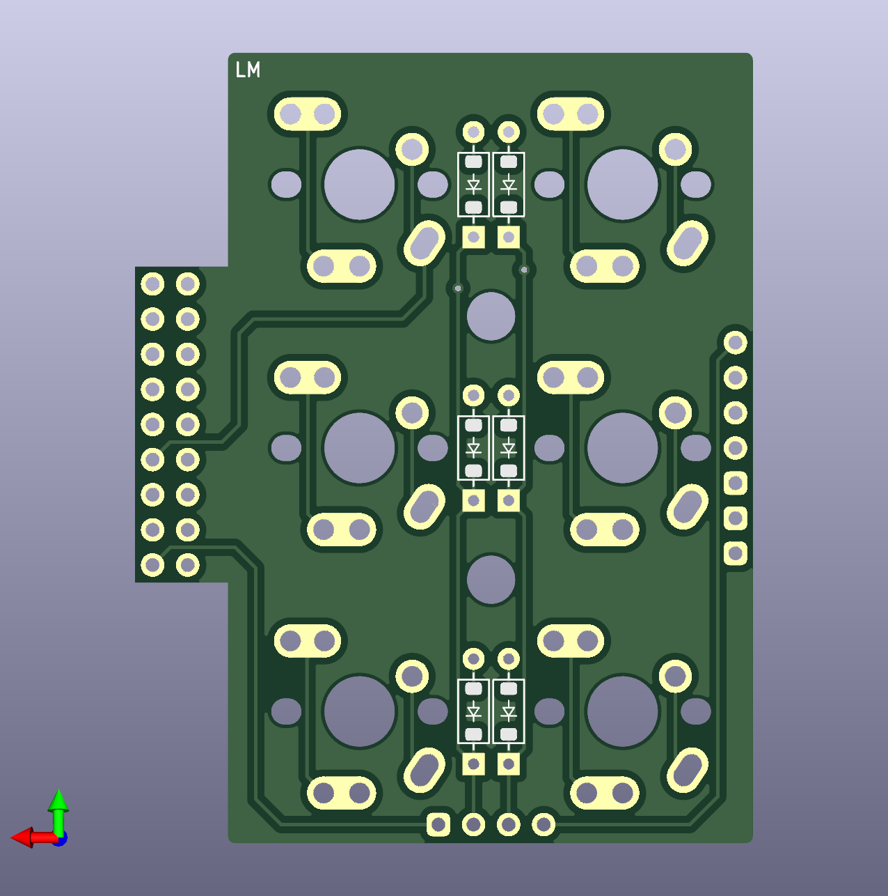
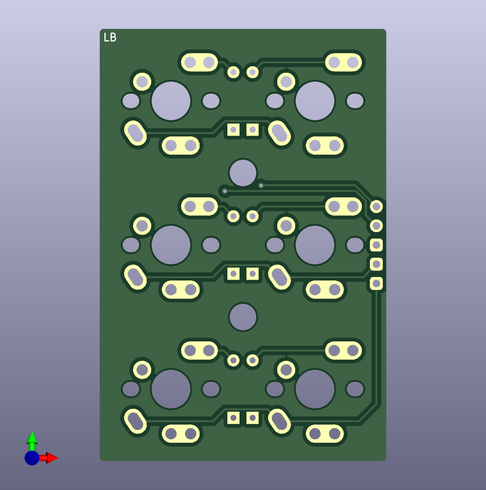

# 組裝說明

## （二）材料準備

|項目|數量|備註|
| -- | -- | -- |
|PCB電路板（PCBs）|合計8片|-|
|[手拉線拓展板](https://github.com/DreaM117er/Handwiring-Microboard)（Handwiring Microboard）|1片|-|
|主定位板（main-plate）|6片|-|
|拇指定位板（thumb-plate）|2片|左右通用|
|上層底板（M、A、B、T）|各2片|4組，合計8片，左右通用|
|下層底板（M、A、B、T）|各2片|4組，合計8片，左右通用|
|MCU保護板（cover）|2片|上下安裝|

## （二）電路板檔案

### 左邊pcb

|部件|正面|背面|
| -- | -- | -- |
|Main|||
|A part|||
|B part|||
|Thumb|||

### 右邊PCB

|部件|正面|背面|
| -- | -- | -- |
|Main|||
|A part|||
|B part|||
|Thumb|||

### 中央（手拉線拓展板）

|部件|正面|背面|
| -- | -- | -- |
|[HMB](https://github.com/DreaM117er/Handwiring-Microboard)|||

## （三）外殼檔案