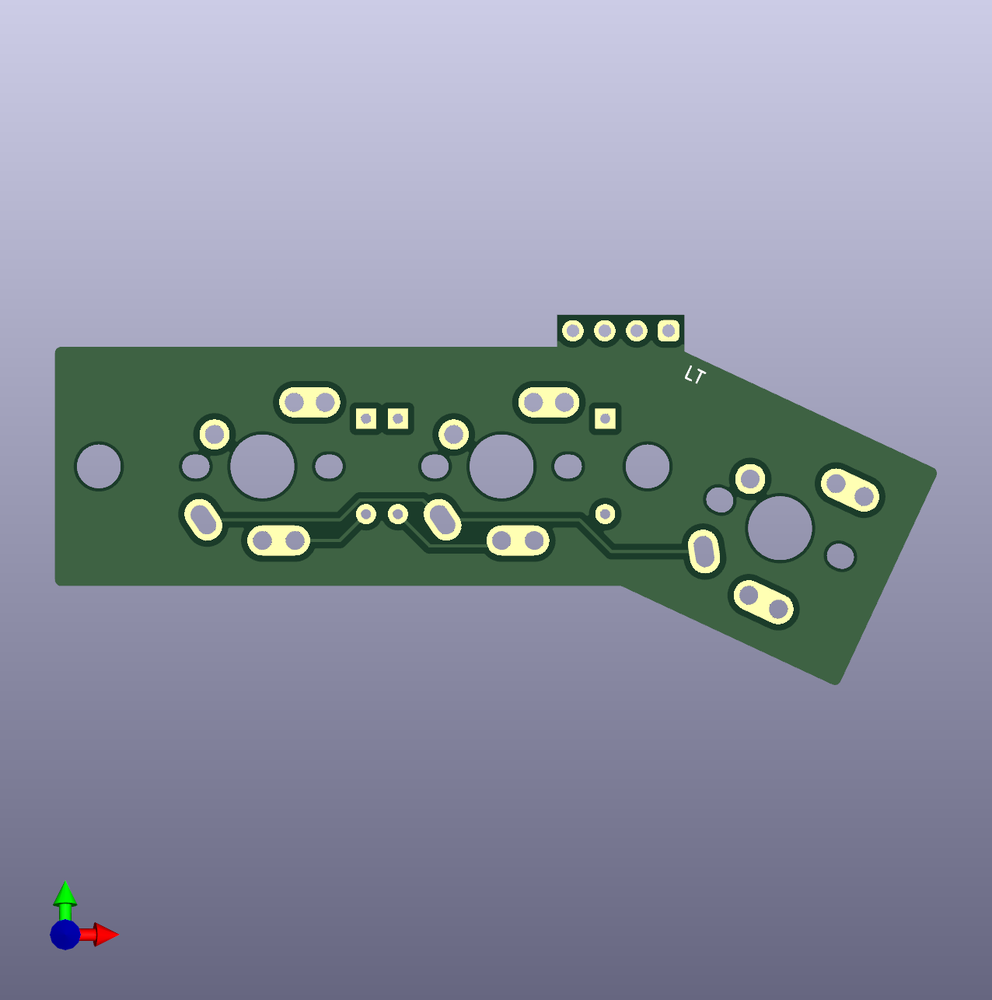
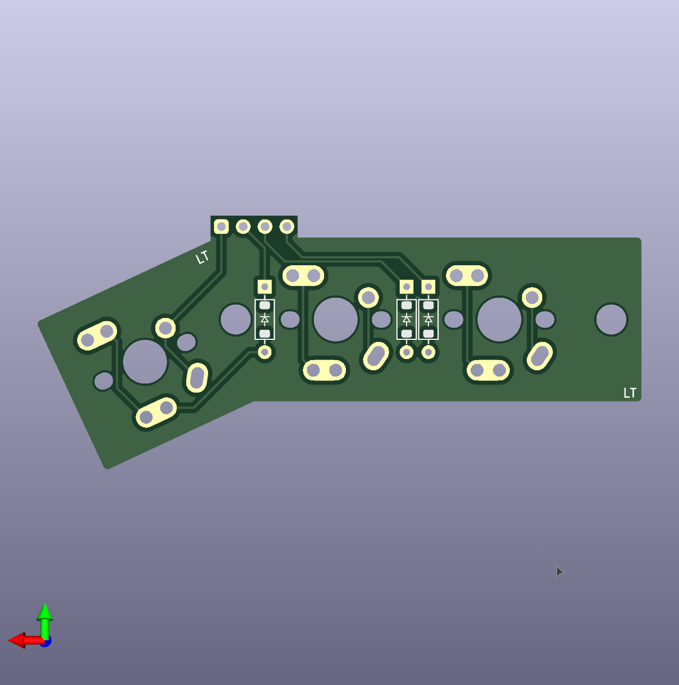
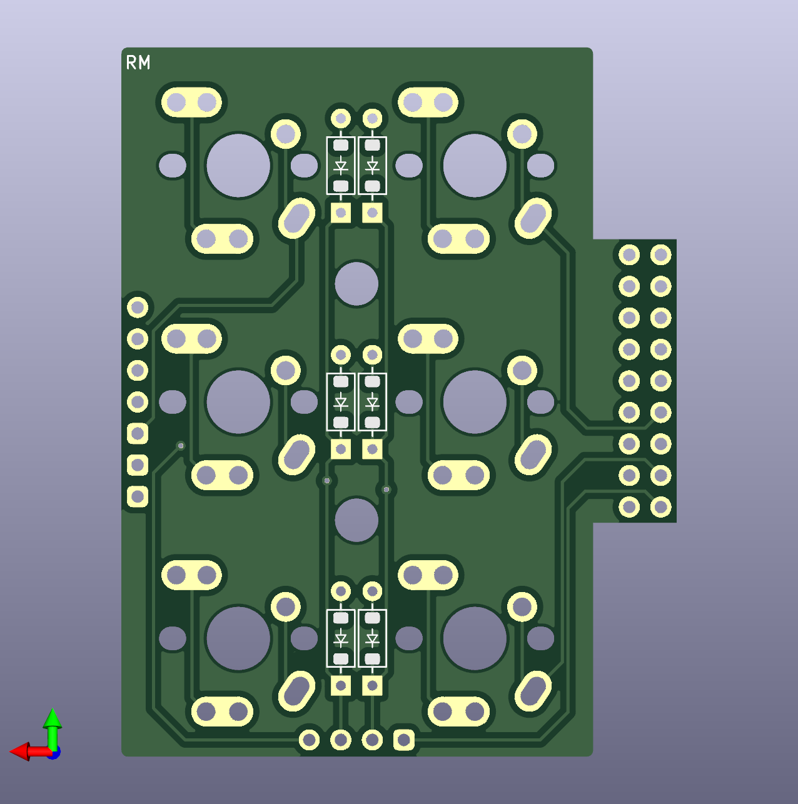
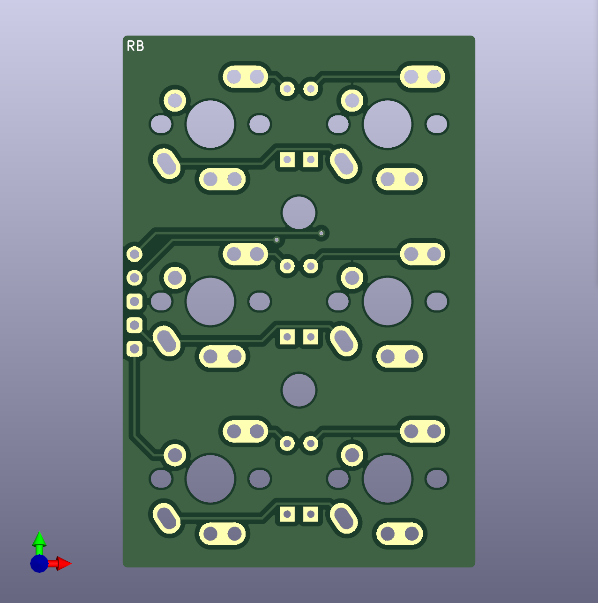
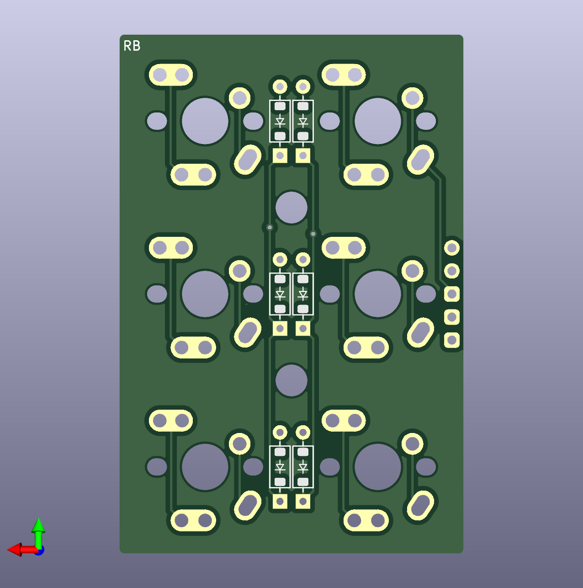
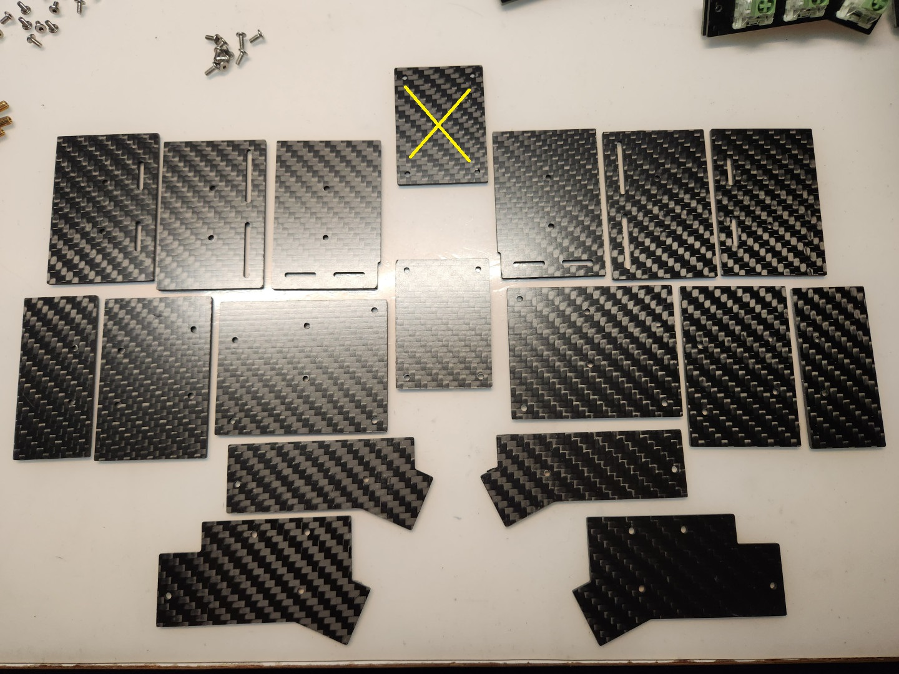

# 組裝說明

## （一）材料準備

### A、共通部分

|項目|數量|備註|
| -- | -- | -- |
|PCB電路板（`PCBs`）|合計8片|-|
|[手拉線拓展板](https://github.com/DreaM117er/Handwiring-Microboard)（`Handwiring Microboard`）|1片|-|
|`Pro Micro` `5V16M`|1片|同腳位MCU都可|
|`1N4148`|42粒|支援`THT`、`SMD`，選擇其中一種版本即可|
|`6mm` `H4.3mm` 輕觸開關 |1個|-|
|主定位板（`main-plate`）|6片|-|
|拇指定位板（`thumb-plate`）|2片|左右通用|
|上層底板（`MA`、`AA`、`BA`、`TA`）|各2片|4組，合計8片，左右通用|
|下層底板（`MB`、`AB`、`BB`、`TB`）|各2片|4組，合計8片，左右通用|
|MCU保護板（`cover`）|2片|上下安裝|
|`ø6mm` `H1.5mm` 矽膠自黏腳貼|-|-|
|`M2 x 4mm` 扁頭螺絲|16個|-|
|`M2 x 5mm` 扁頭螺絲|24個|-|
|`14mm` 雙通銅柱|4個|-|
|`2.54mm間距` 公母圓排針|`12`、`9p`、`5p`|-|
|`28 AWG` 矽膠線|-|-|
|`M2` 六角螺母|12個|-|
|外徑`4mm`、內徑`2mm` 橡膠圈|12個|-|
|`M2` 防滑墊片|12個|-|
|`M2 x 6mm` 扁頭螺絲|12個|-|

### B、Choc矮軸

|項目|數量|備註|
| -- | -- | -- |
|`7mm` 雙通銅柱|12個|主鍵區用|
|`5mm` 雙通銅柱|4個|拇指區|
|鍵軸|42個|`Choc v1`、`Choc v2`、`Gateron矮軸`|

### C、MX軸

|項目|數量|備註|
| -- | -- | -- |
|`10mm` 雙通銅柱|12個|主鍵區用|
|`7mm` 雙通銅柱|4個|拇指區|
|鍵軸|42個|`MX`規格|

## （二）電路板檔案

### A、左手PCB

|部件|正面（Front Side）|背面（Back Side）|
| -- | -- | -- |
|Main|||
|A part|||
|B part|||
|Thumb|||

### B、右手PCB

|部件|正面（Front Side）|背面（Back Side）|
| -- | -- | -- |
|Main|||
|A part|||
|B part|||
|Thumb|||

### C、中央（手拉線拓展板）

|部件|正面（Front Side）|背面（Back Side）|
| -- | -- | -- |
|[HWMB](https://github.com/DreaM117er/Handwiring-Microboard)|||

### D、電路板實體

|視圖|  |
| -- | -- | 

## （三）定位板及底板

> **Warning**
>
> 定位板及底板建議選用`玻璃纖維（FR4）`或`碳纖維（CF）`等相對韌性及硬度較`高`的材質製作，厚度建議為`1.5mm`或`1.6mm`。

### A、定位板

|3D視圖|  |
| -- | -- | 
| 實體 |  | 

### B、上層底板（A）及中央

|3D視圖|  |
| -- | -- | 
| 實體 |  | 

### C、下層底板（B）及中央

|3D視圖|  |
| -- | -- | 
| 實體 |  | 

## （四）組裝開始

### A、拓展板、MCU及韌體

- 首先將手拉線拓展板及MCU主控板準備好。拓展板上面有將`VCC`、`RST`、`GND`等腳位標示出來，請對照MCU`背面`進行焊接安裝。

- 接著將排針切至需要的大小，MCU的話會需要使用到`12pin`、`9pin`及`5pin`；公母排針請自行斟酌使用。

- 這裡先將母排針安裝到拓展板，簡單固定好位置後進行焊接。

- 這裡先將排針的頭尾部分先焊接固定上去，避免歪斜的情況發生。

- 針腳焊接完會是這樣的感覺。

- 接著將公排針安裝到拓展板上的母排針上。

- 然後將MCU對好腳位放上去定位，接著進行焊接。

- 這樣就將MCU固定好了。

- 再來將輕觸開關安裝到拓展板上進行焊接。

- MCU的部分就完成安裝了。

- 接著將MCU接上電腦進行韌體的燒錄，由於現階段開源分離式鍵盤韌體的燒錄方式主流有2種，這裡會簡單的將做法寫下來讓大家參考：

> **Note**
>
> `ATMega32U4`：使用`QMK Toolbox`、`Auto-Flash`的方式進行韌體燒錄，韌體檔案為`.hex`。

> **Note**
>
> `RP2040`：同時作用`Reset`及`Bootloader`雙開關進行韌體燒錄，韌體檔案為`.uf2`。

- 根據個人使用的MCU類型且燒錄完畢後，打開`VIAL`確認鍵盤有沒有被讀取到。

- 確認沒有問題後，準備好`9pin`的公排針4組，進行`RM`及`LM`電路板連接手拉線拓展板的連接。

- 公排針有圓形金屬墊片的部分`朝下`對著PCB安裝，完成固定之後將主控板暫時放在一邊，待會再來安裝

### B、二極體

- 探索者2號早期設計的PCB只能支援`SOD-123`封裝的貼片式二極體，新設計的版本同時支援`直插式`及`貼片式`，這裡就看手邊有什麼類型的二極體擇一做選擇即可。

#### a、貼片式

- 貼片式`1N4148`二極體紅色圈起來的部分為負極，也是PCB上標示的`箭頭方向`。

- 在PCB上二極體其中一邊的焊盤點上錫。

- 接上二極體的其中一邊做固定。

- 固定好二極體的一邊後，再將另一把也點上錫就完成了。

#### b、直插式

- 直插式`1N4148`二極體的黑色端點部分為負極，也是PCB上標示的`箭頭方向`。

- 將其中一端用工具彎曲先固定好長度

- 再將另一端也彎曲。

- 接著將兩邊用焊錫做固定。

- 固定完畢後將背面多餘長度的絲線剪斷即可。

- 接著把8張PCB的二極體都固定上去後，進行下一步。

- 接著將`9pin`的母排針安裝在`RM`及`LM`電路板的`正面`。

- 焊接完成後接著進行下一步。

### C、滑動軌道、底板及銅柱

#### a、滑動軌道

- 這是所有底板的示意圖，首先將其中一片中央的`cover`板暫時放在一邊，它會最後進行安裝。

- 接著準備好`M2x6mm的平頭螺絲`、`M2六角螺母`、`防滑墊片`及`橡膠墊圈`，先將滑動軌道安裝完成。

- 首先將`M2x6mm平頭螺絲`墊在`B底板`的軌道定位螺絲孔下方。

- 再將有2個滑動軌道的`A底板`暫放在2顆定位螺絲上方。

- 接著將`防滑墊片`放在螺絲上。

- 再放上`橡膠墊圈`。

- 然後將`M2六角螺母`固定在螺絲上面，2邊螺絲`簡單鎖緊`即可，並且測試一下滑動軌道的運作順暢度。

- 接著將所有的滑動軌道都安裝完畢。

#### b、銅柱

> **Note**
>
> 接著要來安裝銅柱，請依照使用的鍵軸類型選擇相對應高度的銅柱規格。

|    |銅柱規格|數量|備註|
| -- | -- | -- | -- |
|Choc、LP矮軸|`7mm`|12個|主鍵區用|
|Choc、LP矮軸|`5mm`|4個|拇指區|
|MX軸|`10mm`|12個|主鍵區用|
|MX軸|`7mm`|4個|拇指區|
|中央區域|`14mm`|4個|-|

- 接著就依照上述表格進行銅柱的安裝，安裝固定好滑動軌道後，剩下的螺絲孔都是安裝銅柱的，請使用`M2x5mm`的螺絲進行安裝。

- 完成左右邊底板後，再將中央`cover`底板及`14mm銅柱`安裝上去。

- 這樣底板就安裝好了。

- 接著進行滑動軌道測試，請將它拿起來直接挪移。

- 確認沒有問題後，底板翻至背面即可將`自黏腳貼`貼上，建議粘貼位置為`滑動軌道正下方`及`邊緣區域`。

### D、PCB連接及鍵軸安裝固定