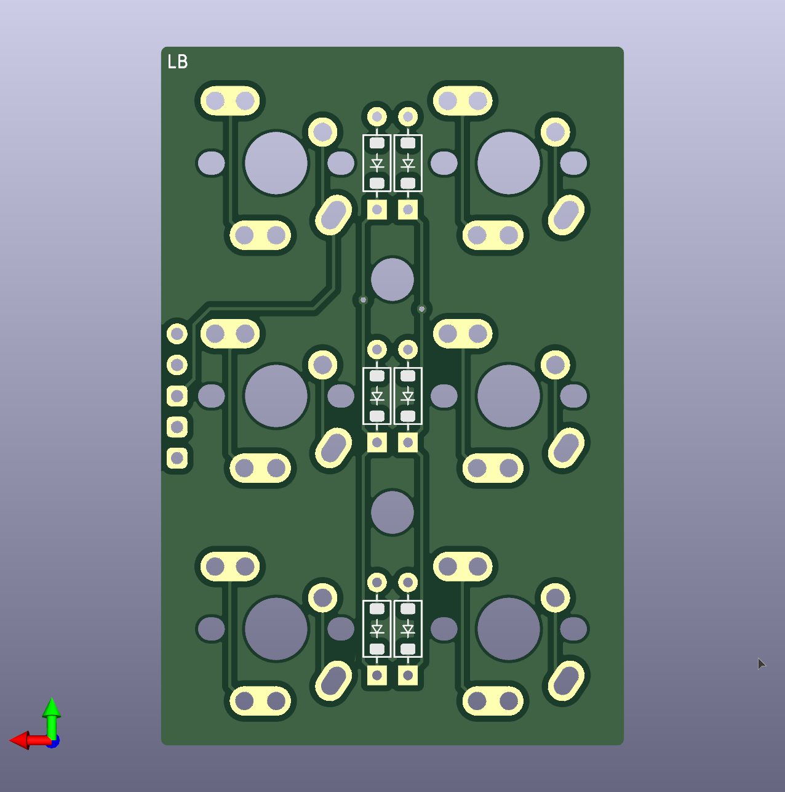
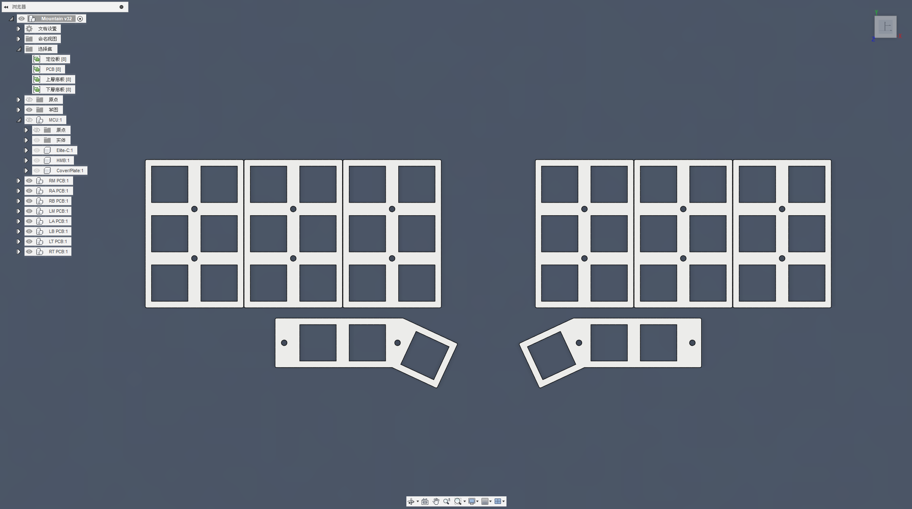

# 組裝說明

## （一）材料準備

|項目|數量|備註|
| -- | -- | -- |
|PCB電路板（`PCBs`）|合計8片|-|
|[手拉線拓展板](https://github.com/DreaM117er/Handwiring-Microboard)（`Handwiring Microboard`）|1片|-|
|主定位板（`main-plate`）|6片|-|
|拇指定位板（`thumb-plate`）|2片|左右通用|
|上層底板（`MA`、`AA`、`BA`、`TA`）|各2片|4組，合計8片，左右通用|
|下層底板（`MB`、`AB`、`BB`、`TB`）|各2片|4組，合計8片，左右通用|
|MCU保護板（`cover`）|2片|上下安裝|
|`Pro Micro` `5V16M`|1片|同腳位MCU都可|
|`6mm` `H4.3mm` 輕觸開關 |1個|-|
|`2.54mm間距` 單排排針|`12`、`9p`、`5p`|-|
|`2.54mm間距` 公母圓排針|`12`、`9p`、`5p`|選配|
|鍵軸（`MX`、`Choc v1`、`Choc v2`、`Gateron矮軸`）|42顆|-|
|`1N4148` `SOD-123`|42粒|-|
|`5mm` 雙通銅柱|16個|`Choc v1`、`Choc v2`、`Gateron矮軸`用|
|`10mm` 雙通銅柱|4個|`Choc v1`、`Choc v2`、`Gateron矮軸`用|
|`7mm` 雙通銅柱|16個|`MX`用|
|`12mm` 雙通銅柱|4個|`MX`用|
|`M2 x 4mm` 扁頭螺絲|28個|-|
|`M2 x 5mm` 扁頭螺絲|24個|-|
|`M2` 六角螺母|12個|-|
|`28 AWG` 矽膠線|-|-|
|`ø6mm` `H1.5mm` 矽膠自黏腳貼|-|-|

## （二）電路板檔案

### A、左手PCB

|部件|正面（Front Side）|背面（Back Side）|
| -- | -- | -- |
|Main|||
|A part|||
|B part|||
|Thumb|||

### B、右手PCB

|部件|正面（Front Side）|背面（Back Side）|
| -- | -- | -- |
|Main|||
|A part|||
|B part|||
|Thumb|||

### C、中央（手拉線拓展板）

|部件|正面（Front Side）|背面（Back Side）|
| -- | -- | -- |
|[HWMB](https://github.com/DreaM117er/Handwiring-Microboard)|||

### D、電路板實體

|視圖|  |
| -- | -- | 

## （三）定位板及底板

> **Warning**
>
> 定位板及底板建議選用`玻璃纖維（FR4）`或`碳纖維（CF）`等相對韌性及硬度較`高`的材質製作，厚度建議為`1.5mm`或`1.6mm`。

### A、定位板

|3D視圖|  |
| -- | -- | 
| 實體 |  | 

### B、上層底板（A）及中央

|3D視圖|  |
| -- | -- | 
| 實體 |  | 

### C、下層底板（B）及中央

|3D視圖|  |
| -- | -- | 
| 實體 |  | 

## （四）組裝開始

### A、主控板、MCU及韌體

- 首先將手拉線拓展板及MCU主控板準備好。拓展板上面有將`VCC`、`RST`、`GND`等腳位標示出來，請對照MCU`背面`進行焊接安裝。

- 接著將排針切至需要的大小，MCU的話會需要使用到`12pin`及`5pin`；如果未來有需要更換MCU的話，可以使用照片中的超矮公母圓排針進行焊接安裝。

- 這裡先將母排針安裝到拓展板，簡單固定好位置後進行焊接。

- 這裡先將排針的頭尾部分先焊接固定上去，避免歪斜的情況發生。

- 針腳焊接完會是這樣的感覺。

- 接著將公排針安裝到拓展板上的母排針上。

- 然後將MCU對好腳位放上去定位，接著進行焊接。

- 這樣就將MCU固定好了。

- 再來將輕觸開關安裝到拓展板上進行焊接。

- MCU的部分就完成安裝了。

- 接著將MCU接上電腦進行韌體的燒錄，由於現階段開源分離式鍵盤韌體的燒錄方式主流有2種，這裡我只會簡單的將做法寫下來讓大家參考：

> **Note**
>
> `ATMega32U4`：使用`QMK Toolbox`、`Auto-Flash`的方式進行韌體燒錄，韌體檔案為`.hex`。

> **Note**
>
> `RP2040`：同時作用`Reset`及`Bootloader`雙開關進行韌體燒錄，韌體檔案為`.uf2`。

- 根據個人使用的MCU類型且燒錄完畢後，打開`VIAL`確認鍵盤有沒有被讀取到。

- 確認沒有問題後，就可以將MCU的部分先暫時放一邊，待會會再用到。

### B、上下層底板