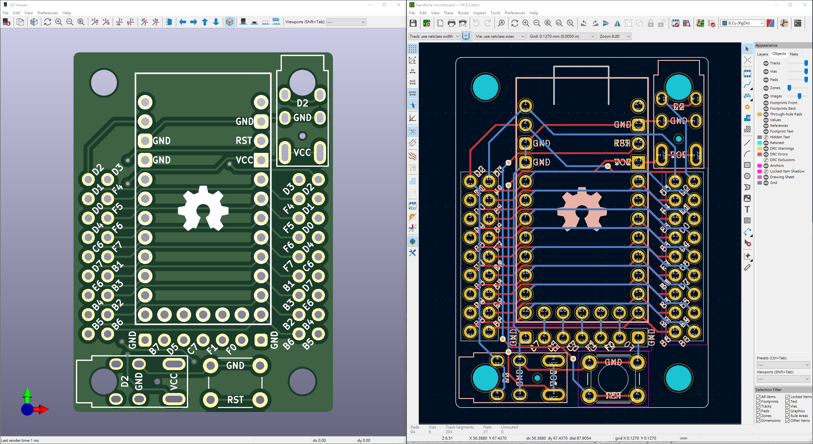
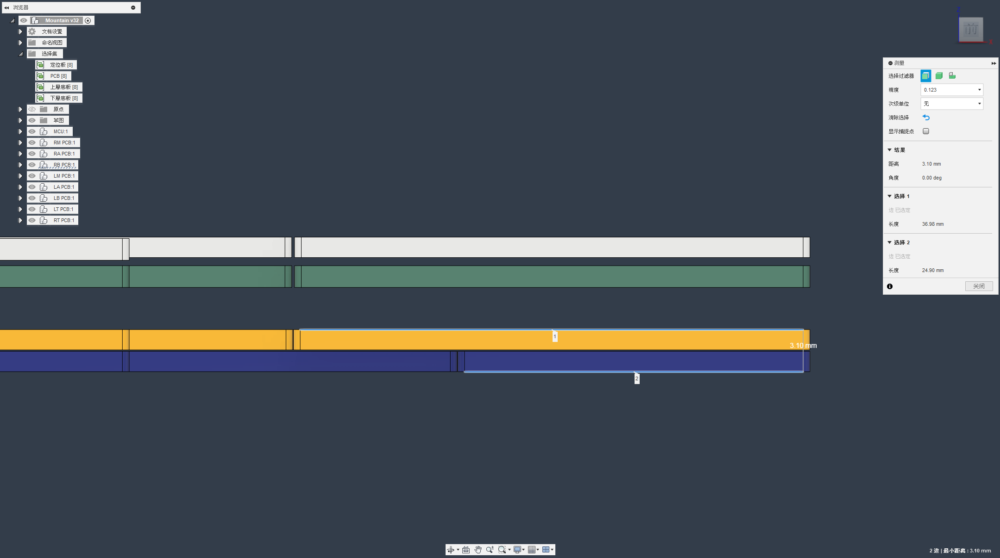
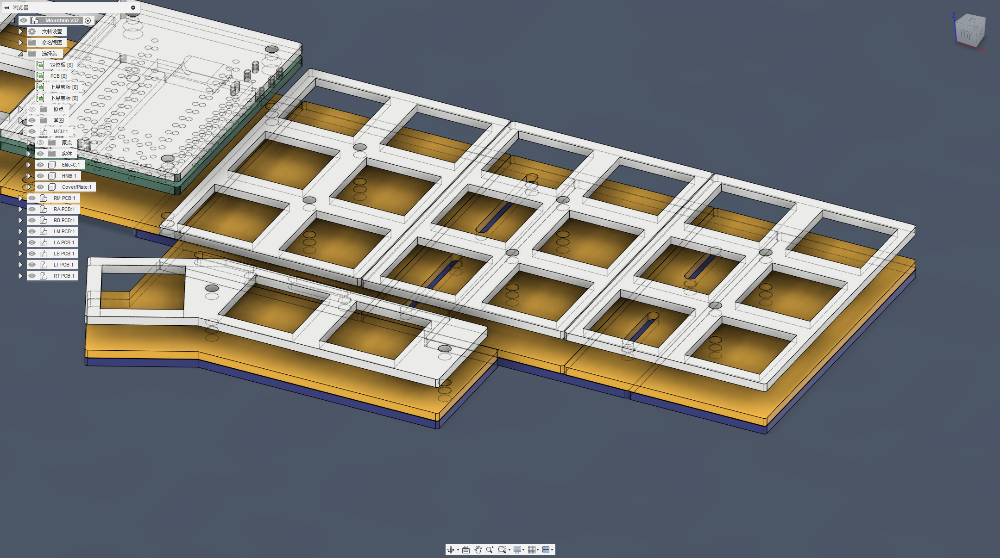

# 開發日誌

## 開發歷史

- 22.07.22 完成簡易版Plancklite。
- 22.07.22 完成探索者2號的3D結構。
- 22.07.23 最終修正修正探索者2號PCB邊緣。
- 22.07.24 向JLCPCB請求製作PCB訂單。
- 22.07.26 向鑫帆宇碳纤维用品加工店定製碳纖維材質外殼。
- 22.07.26 探索者2號的github頁面正式建立。

## 開發歷程

為了自己製作鍵盤，2023年年初我學習了3D繪圖，使用Fusion360製作了我的第一把鍵盤探索者1號，同時也將探索者系列這個特別的計劃定型，往後這個系列會出產一些顛覆想像的機械鍵盤。當然，一開始也有提到，探索者2號從1號設計出來沒多久就已經將名稱定下，希望這把鍵盤能夠將鍵盤立起來擺放為出發點，做一個擁有探索者精神，也就是超高自由度的機械鍵盤。

但整個過程往往不會按照最初的意思走，最初還沒有正式開始學習KiCAD怎麼使用時，我都是以手拉線方式為基底製作鍵盤的3D模型，但製作出來的成果都不滿意，於是就將2號的開發暫時放一邊，轉而開始開發探索者的其他系列。一直到將KiCAD學習差不多之後，將手拉線拓展板製作（[Handwiring Microboard](https://github.com/DreaM117er/Handwiring-Microboard)）出來後，才正式將鍵盤的基礎定型，因為這個拓展板能夠更方便地製作鍵盤，其最大的可能性是能製作矩陣大小17x6的機械鍵盤，也就是80% TKL的大小。

開發拓展板到v3版本時，我發現手邊累積的單格電路板、瑕疵拓展板有一定程度的量，這樣想想也不是什麼辦法，於是就將Fusion360打開，以Planck為基礎設計了一個簡單的模型，就這樣將模型交給定製壓克力及碳纖維的廠家定製，製作出來的就是Plancklite，我將它稱作試做型系列。

7月22日當天在臺灣高雄衛武營舉辦鍵盤好貴的鍵盤線下交流聚會，我將這把鍵盤帶過去做展示，與一般客製化鍵盤不同的是，我喜歡運用手邊的材料自己製作鍵盤，當天也和使用分離式鍵盤的使用者進行交流，相當地愉快。聚會當天返程回家之後正式開始使用Plancklite開始著手製作探索者2號的PCB及外殼結構的設計。

新版的手拉線拓展板捨棄了當初以分離式鍵盤為出發點而將針腳拓展到左右邊，而是依據使用的主控板上可用做訊號編程的18個針腳直接拓展到板子的左右2側做對稱拓展，這樣有一個好處，不管開發板要定位在鍵盤按鍵的任何一側都非常容易安裝。

新設計的PCB搭配v4版本的拓展板後，整體的結構就已經定型，於是花了點時間模擬鍵盤要如何做出可以變更結構的固定方式，最後想到的就是使用雙層的底板做結構變化。

大家試想一下，3.2mm有多厚？而這個厚度很厚嗎？

採用雙層結構的原因大致上圍繞這2個問題在轉，雙層的底板乍看下相當的厚實，但每層的厚度僅僅只有一般電路板1.6mm厚度，這個厚度堆疊起來實際上真的沒有這麼厚，Plancklite這把小鍵盤的底板加上腳墊的厚度其實也有4mm左右，這也是為什麼我這麼放心地使用雙層結構。

再來是滑軌結構，這是參照另一把鍵盤[Dactyl Chimera](https://github.com/WolfIcefang/dactyl-chimera-keyboard)的，為了定住鍵盤的雙層結構，我將螺母定位成滑軌移動元件，開孔設計在上層底板上，下層底板用於將鍵盤配列整個固定住不要亂滑動，中央的螺絲用於固定2x6的定位板。

也因為這個結構，導致使用的底板材質需要一定程度的韌性及硬度，這也是為什麼只推薦使用比FR4（玻璃纖維）及碳纖維去製作的原因，當然如果使用3D列印的話，成品如果硬度不會讓鍵盤底板在密合時有很明顯變形的話，那也可以作為替代。

簡單來說，這把鍵盤其實能夠寫的東西並不是很多，最難的地方就在你要怎麼將鍵盤的自由度在有限的空間展現出來，並且能夠在這個基礎上正常地讓使用者能夠好好使用。探索者系列不僅僅是將自由度帶給了你，如果能夠讓你就此愛上鍵盤的話，那麼我的目的就已經達成了。

謝謝大家能夠看到這邊，希望各位都是喜歡鍵盤的鍵盤人，那麼我們下一把鍵盤再見。