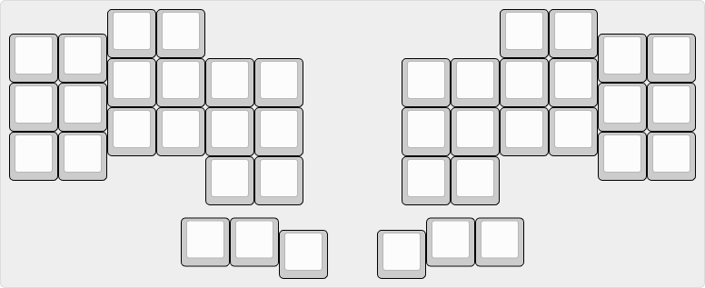
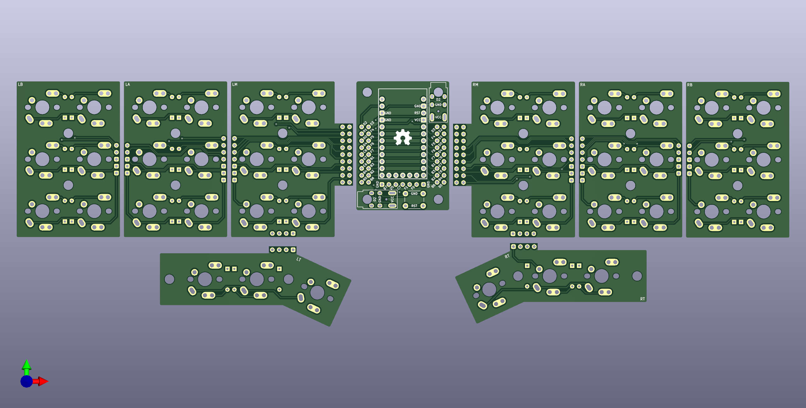
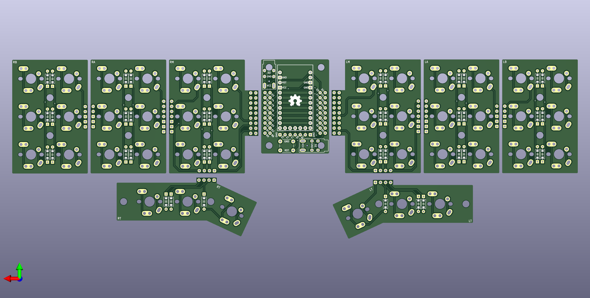
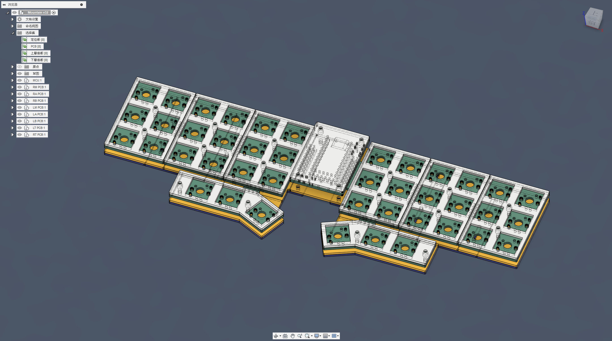

# Explorer Keyboard Mountain 探索者2號

### MX鍵軸 

### Choc矮軸

## 開發者前言

Planck好不好用？這是我在接觸分離式鍵盤之後很多人問我的問題，我可以說它相當地好用，是第一次接觸分離式鍵盤的初心者在使用它之後也非常容易上手，且不論這把直列式鍵盤類型是不是分離式。根據Planck入門的好用程度，首先我製作了一把以Planck為雛形的直列式小鍵盤Plancklite，省去了小指及無名指最難接觸到的左下角、右下角的各3顆按鍵，再將鍵盤從中央分開來成左右兩邊、拇指區向下跟主鍵區位移3mm的設計。

這樣去更動配列的好處其實改善了Planck鍵盤配列的幾個問題：

- 按鍵佈局太緊湊。
- 省去手指正常移動軌跡中根本按不到的按鍵。
- 保留Planck直列式鍵盤的打字手感，甚至更好。
- 可作為分離式鍵盤練習使用。

於是根據這把小鍵盤Plancklite，更進一步構想出這把可以變動配列的探索者2號。

這次的開發跟探索者1號那次不太一樣，開發、構想、設計、命名全靠我一個人，特別在這次的開發上，我特別學習了Kicad的使用，同時運用Fusion360做鍵盤的3D結構模擬及零件的檔案輸出，能夠這樣開發出自己的鍵盤，真的相當不容易。

至於命名的部分，為什麼叫做Mountian呢？其實探索者2號的命名在1號設計出來沒多久就定下來了，原先它的目標是能夠立起來的設計，在設計過地程中主鍵偏離這個構想，後來才想到這個類似七巧板的設計，但原先定下來的命名就繼續沿用了，但它現在的構造其實也蠻符合這個味道，請繼續看下去。

如果大家對這把鍵盤有興趣的話，不妨嘗試自己做看看：[組裝說明](guide.md)

## 配列佈局

探索者2號有2種佈局可以變更，預設佈局為Plancklite的設計，拇指區最外側旋轉25度腳的設計，在使用上更貼合拇指移動的按鍵軌跡。

在此之上，根據鍵盤結構的變化，可將Plancklite的配列變更為Stagger的配列：

## 鍵盤結構

- 根據PCB分為M（Main）、A（A part）、B（B part）、T（Thumb）4個部件，左右邊合計8張PCB。
- 左右邊代號分別為：左（L）、右（R）。
- 鍵盤上下結構分為：Plate（定位板）、A（上層底板）、B（下層底板）。
- MCU的部分採用手拉線拓展板安裝（[Handwiring Microboard](https://github.com/DreaM117er/Handwiring-Microboard)）。
- PCB採全焊接設計，可使用MX、Choc v1、Choc v2、Gateron矮軸等4款不同腳位、不同類型的軸體。
- 可依據需求進行配列的變更，Plancklite及Stagger可選擇。

### PCB視圖

### 3D視圖

## 參考資料及使用工具

- [凱華電子規格書](https://www.kailh.net/pages/product-datasheet)（MX、Choc v1、Choc v2）。
- 佳特隆電子規格書（[Gateron矮軸](https://www.gateron.co/products/gateron-low-profile-mechanical-switch-set)）。
- [KiCAD](https://www.kicad.org/) version 7.05。
- Autodesk Fusion360。
- [JLCPCB](https://jlcpcb.com/)。
- [鑫帆宇碳纤维用品加工店](https://shop73091441.taobao.com/?spm=a1z10.1-c-s.0.0.3530f19cYKPwZf)。
- [開發日製](log.md)。