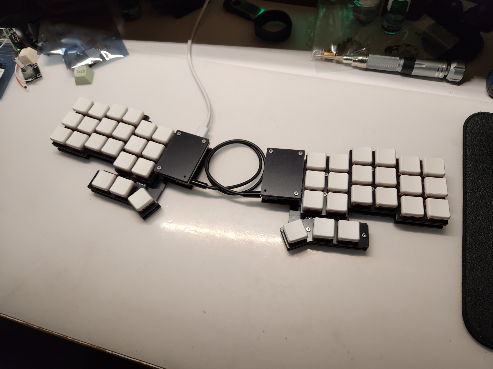
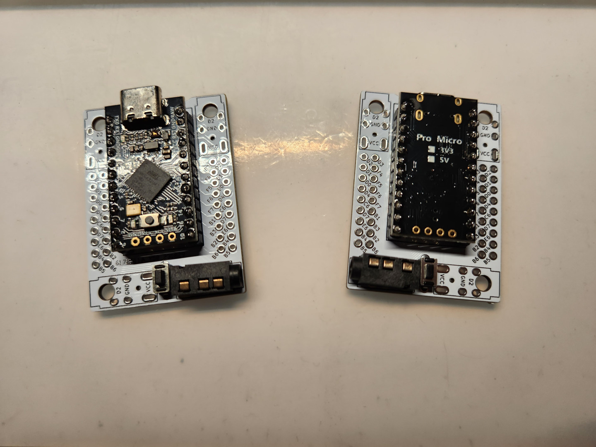
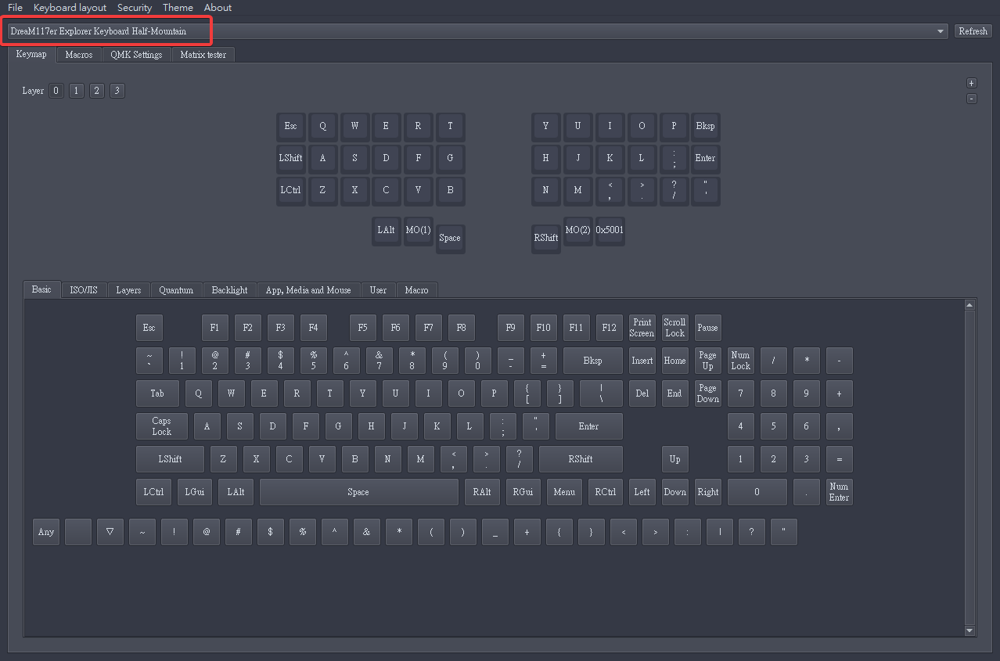
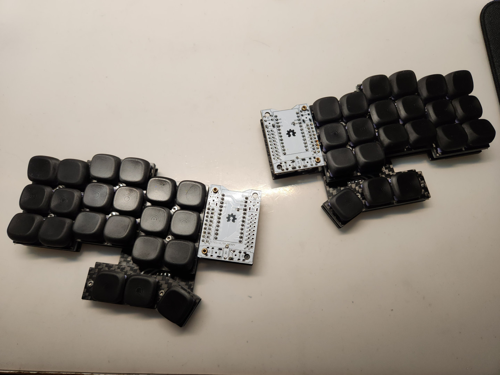

# Explorer Keyboard Half-Mountain 探索者2號（分離式）

## 開發者前言

探索者2號分離式版是2號本身的進階運用，使用2片的手拉線拓展板進行拓展，將一體式的探索者2號直接從中央切開來，再用分離式鍵盤常見的TRS或TRRS線做左右兩側鍵盤的連接，來滿足不喜歡一體式鍵盤使用者的需求。

由於是分離式版的探索者2號是將鍵盤從中央切開來的原因，很直接地將鍵盤稱之為`半山（Half-Mountain）`。

## 組裝說明

Half-Mountain是在Mountain的基礎上做延伸的分離式鍵盤，詳見以下材料不同處：

|項目|數量|備註|
| -- | -- | -- |
|[手拉線拓展板](https://github.com/DreaM117er/Handwiring-Microboard)（`Handwiring Microboard`）|2片|-|
|`Pro Micro` `5V16M`|2片|同腳位MCU都可|
|MCU保護板（`cover`）|4片|上下及左右|
|`TRRS座`|2個|-|
|`2pin` 輕觸開關|2個||

- 其餘材料都和[Mountain](https://github.com/DreaM117er/Explorer-Keyboard-Mountian/blob/main/guide.md#a%E5%85%B1%E9%80%9A%E9%83%A8%E5%88%86)一致。

## 組裝步驟

- 請按照步驟先將2片手拉線拓展版安裝完畢：[請點這裡](https://github.com/DreaM117er/Handwiring-Microboard)。

- 接著將Half-Mountain的韌體燒錄進左右手MCU中。（詳見`Release`）

- 接著將Mountian的左右邊外殼及鍵盤依序完成：[請點這裡](guide.md)。

- 將左右手鍵盤各安裝一片手拉線拓展板後，將外殼安裝上去就完成了。

## 注意事項

> **Warning**
>
> 分離式版的探索者2號會犧牲左右邊鍵盤手拉線拓展板的1個螺絲鎖點，不會影響使用。

> **Warning**
>
> 安裝TRRS座時留意方向性及螺絲鎖點，與左右鍵盤本體至少要有`2個鎖點`。

> **Warning**
>
> 鍵盤預設為`左側為主`鍵盤，`右側為輔`；有特殊需求請至`Fork/vial-qmk`詳見韌體代碼。